_Note that this project depends on internal Symphony infrastructure (repository.symphony.com), and therefore it can only be built by Symphony LLC employees/partners._

# Trello WebHook Integration
With the Trello WebHook Integration you can configure which Trello boards you want to receive notifications from, and what sort of activity you want to be notified about.

## [Build Instructions](#build-instructions-for-the-java-developer)

## How it works
As a Symphony user you can configure a WebHook with Trello directly from the Trello WebHook Application available on Symphony Market. There you can choose which events you want to be notified from Trello, no further setup required.

## What formats and events it support and what it produces
Every integration will receive a message sent in a specific format (depending on the system it ingests) and will usually convert it into an "entity" before it reaches the Symphony platform. It will also, usually, identify the kind of message based on an "event" identifier, which varies based on the third-party system.

This "entity" we generate will have information necessary to be rendered on Symphony Platform, distributed by tags.
Although these tags may vary greatly among every integration event, they must all have at least the tag ``<presentationML>``, which follows the rules presented [here](https://rest-api.symphony.com/docs/message-format/).
This is a special tag that must hold all content that would be otherwise drawn on Symphony by the other tags, in a single string on its content.
It is important that it contains matching information as it is used for visualising a message when a specific renderer is not present, on Symphony mobile apps or content export.

There's currently eighteen events from Trello that we support, but those, for convenience, are being mapped to twenty internal events to better represent user interactions with Trello. 

Those events are grouped inside four main categories: Boards, Cards, Lists and Checklists.
On each of those we'll detail which events maps to our internal events, the payload that Trello sends to us, what we convert those into and what the message looks like when posted on the Symphony platform.

### Boards
###### "updateBoard"
* Event maps to "boardRenamed"

[JSON payload](src/test/resources/payload_trello_board_updated.json)

Converted to Symphony Message ML
```xml
<messageML>
    <entity type="com.symphony.integration.trello.event.updateBoard" version="1.0">
      <presentationML>
        Evandro Carrenho @symphony renamed Board New Name (from Board renamed) (<a href="https://trello.com/b/t0hu7Ffx" />)
      </presentationML>
      <attribute name="date" type="org.symphonyoss.time.rfc3339" value="2016-09-12T15:58:42.540Z" />
      <entity name="memberCreator" type="com.symphony.integration.trello.user" version="1.0">
        <attribute name="username" type="org.symphonyoss.string" value="ecarrenhosymphonytest" />
        <attribute name="emailAddress" type="org.symphonyoss.string" value="ecarrenhosymphonytest@symphony.com" />
        <attribute name="displayName" type="org.symphonyoss.string" value="Evandro Carrenho @symphony" />
        <entity type="com.symphony.mention" version="1.0">
          <attribute name="id" type="org.symphony.oss.number.long" value="699722783" />
          <attribute name="name" type="org.symphonyoss.string" value="Evandro Carrenho @symphony" />
        </entity>
      </entity>
      <entity type="com.symphony.integration.trello.data" version="1.0">
        <entity type="com.symphony.integration.trello.board" version="1.0">
          <attribute name="shortUrl" type="com.symphony.uri" value="https://trello.com/b/t0hu7Ffx" />
          <attribute name="name" type="org.symphonyoss.string" value="Board New Name" />
          <attribute name="id" type="org.symphonyoss.string" value="57a34b33b350eb2bcc1f42ca" />
          <entity type="com.symphony.integration.trello.prefs" version="1.0">
            <attribute name="background" type="org.symphonyoss.string" value="blue" />
            <attribute name="backgroundColor" type="org.symphonyoss.string" value="#0079BF" />
          </entity>
        </entity>
        <entity type="com.symphony.integration.trello.changelog" version="1.0">
          <entity type="com.symphony.integration.trello.change" version="1.0">
            <attribute name="fieldName" type="org.symphonyoss.string" value="name" />
            <attribute name="oldValue" type="org.symphonyoss.string" value="Board renamed" />
            <attribute name="newValue" type="org.symphonyoss.string" value="Board New Name" />
          </entity>
        </entity>
      </entity>
    </entity>
</messageML>
```
Message rendered on Symphony

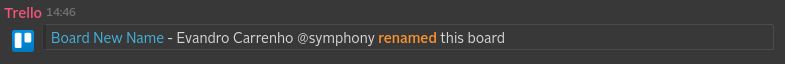

###### "addMemberToBoard"
* Event maps to "memberAddedToBoad"

[JSON payload](src/test/resources/payload_trello_board_member_added.json)

Converted to Symphony Message ML
```xml
<messageML>
    <entity type="com.symphony.integration.trello.event.addMemberToBoard" version="1.0">
        <presentationML>
            Evandro Carrenho @symphony added Evandro Carrenho to Board renamed (<a href="https://trello.com/b/t0hu7Ffx"/>)
        </presentationML>
        <attribute name="date" type="org.symphonyoss.time.rfc3339" value="2016-09-12T15:41:52.030Z"/>
        <entity name="memberCreator" type="com.symphony.integration.trello.user" version="1.0">
            <attribute name="username" type="org.symphonyoss.string" value="ecarrenhosymphonytest"/>
            <attribute name="emailAddress" type="org.symphonyoss.string" value="ecarrenhosymphonytest@symphony.com"/>
            <attribute name="displayName" type="org.symphonyoss.string" value="Evandro Carrenho @symphony"/>
            <entity type="com.symphony.mention" version="1.0">
                <attribute name="id" type="org.symphony.oss.number.long" value="699722784"/>
                <attribute name="name" type="org.symphonyoss.string" value="Evandro Carrenho @symphony"/>
            </entity>
        </entity>
        <entity name="member" type="com.symphony.integration.trello.user" version="1.0">
            <attribute name="username" type="org.symphonyoss.string" value="evandrocarrenho"/>
            <attribute name="emailAddress" type="org.symphonyoss.string" value="evandrocarrenho@symphony.com"/>
            <attribute name="displayName" type="org.symphonyoss.string" value="Evandro Carrenho"/>
            <entity type="com.symphony.mention" version="1.0">
                <attribute name="id" type="org.symphony.oss.number.long" value="699722783"/>
                <attribute name="name" type="org.symphonyoss.string" value="Evandro Carrenho"/>
            </entity>
        </entity>
        <entity type="com.symphony.integration.trello.data" version="1.0">
            <attribute name="idMemberAdded" type="org.symphonyoss.string" value="57a10c3b4ba8a7f29b3c238a"/>
            <attribute name="memberType" type="org.symphonyoss.string" value="normal"/>
            <entity type="com.symphony.integration.trello.board" version="1.0">
                <attribute name="shortUrl" type="com.symphony.uri" value="https://trello.com/b/t0hu7Ffx"/>
                <attribute name="name" type="org.symphonyoss.string" value="Board renamed"/>
                <attribute name="id" type="org.symphonyoss.string" value="57a34b33b350eb2bcc1f42ca"/>
                <entity type="com.symphony.integration.trello.prefs" version="1.0">
                    <attribute name="background" type="org.symphonyoss.string" value="blue"/>
                    <attribute name="backgroundColor" type="org.symphonyoss.string" value="#0079BF"/>
                </entity>
            </entity>
        </entity>
    </entity>
</messageML>
```
Message rendered on Symphony

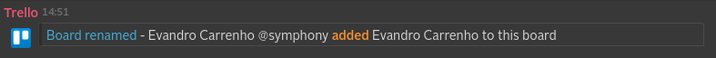

###### "addToOrganizationBoard"
* Event maps to "boardAddedToTeam"

[JSON payload](src/test/resources/payload_trello_board_added_team.json)

Converted to Symphony Message ML
```xml
<messageML>
    <entity type="com.symphony.integration.trello.event.addToOrganizationBoard" version="1.0">
        <presentationML>
            Evandro Carrenho @symphony added Board renamed to My Trello Team (<a href="https://trello.com/b/t0hu7Ffx"/>)
        </presentationML>
        <attribute name="date" type="org.symphonyoss.time.rfc3339" value="2016-09-12T14:36:16.102Z"/>
        <entity name="memberCreator" type="com.symphony.integration.trello.user" version="1.0">
            <attribute name="username" type="org.symphonyoss.string" value="ecarrenhosymphonytest"/>
            <attribute name="emailAddress" type="org.symphonyoss.string" value="ecarrenhosymphonytest@symphony.com"/>
            <attribute name="displayName" type="org.symphonyoss.string" value="Evandro Carrenho @symphony"/>
            <entity type="com.symphony.mention" version="1.0">
                <attribute name="id" type="org.symphony.oss.number.long" value="699722783"/>
                <attribute name="name" type="org.symphonyoss.string" value="Evandro Carrenho @symphony"/>
            </entity>
        </entity>
        <entity type="com.symphony.integration.trello.data" version="1.0">
            <entity type="com.symphony.integration.trello.board" version="1.0">
                <attribute name="shortUrl" type="com.symphony.uri" value="https://trello.com/b/t0hu7Ffx"/>
                <attribute name="name" type="org.symphonyoss.string" value="Board renamed"/>
                <attribute name="id" type="org.symphonyoss.string" value="57a34b33b350eb2bcc1f42ca"/>
                <entity type="com.symphony.integration.trello.prefs" version="1.0">
                    <attribute name="background" type="org.symphonyoss.string" value="blue"/>
                    <attribute name="backgroundColor" type="org.symphonyoss.string" value="#0079BF"/>
                </entity>
            </entity>
            <entity type="com.symphony.integration.trello.organization" version="1.0">
                <attribute name="id" type="org.symphonyoss.string" value="57a10d35e68764461773a275"/>
                <attribute name="name" type="org.symphonyoss.string" value="My Trello Team"/>
            </entity>
        </entity>
    </entity>
</messageML>
```
Message rendered on Symphony

* missing sample
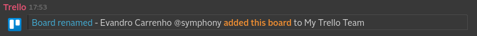

### Cards
###### "createCard"
* Event maps to "cardCreated"

[JSON payload](src/test/resources/payload_trello_card_created.json)

Converted to Symphony Message ML
```xml
<messageML>
    <entity type="com.symphony.integration.trello.event.createCard" version="1.0">
        <presentationML>
            Joe Smith added My Card to My List (in My &lt;b&gt;Trello&lt;/b&gt;<br/><br/>Board) (<a href="https://trello.com/t0hu7Ffx"/>)
        </presentationML>
        <attribute name="date" type="org.symphonyoss.time.rfc3339" value="2016-08-04T14:24:09.667Z"/>
        <entity name="memberCreator" type="com.symphony.integration.trello.user" version="1.0">
            <attribute name="username" type="org.symphonyoss.string" value="jsmith"/>
            <attribute name="displayName" type="org.symphonyoss.string" value="Joe Smith"/>
        </entity>
        <entity type="com.symphony.integration.trello.data" version="1.0">
            <entity type="com.symphony.integration.trello.board" version="1.0">
                <attribute name="shortUrl" type="com.symphony.uri" value="https://trello.com/t0hu7Ffx"/>
                <attribute name="name" type="org.symphonyoss.string"
                           value="My &amp;lt;b&amp;gt;Trello&amp;lt;/b&amp;gt;&lt;br/&gt;&lt;br/&gt; Board"/>
                <attribute name="id" type="org.symphonyoss.string" value="57a34b33b350eb2bcc1f42ca"/>
            </entity>
            <entity type="com.symphony.integration.trello.list" version="1.0">
                <attribute name="name" type="org.symphonyoss.string" value="My List"/>
                <attribute name="id" type="org.symphonyoss.string" value="57a34bdaa4050393a6f15a24"/>
            </entity>
            <entity type="com.symphony.integration.trello.card" version="1.0">
                <attribute name="shortLink" type="org.symphonyoss.string" value="thH8QUqG"/>
                <attribute name="name" type="org.symphonyoss.string" value="My Card"/>
                <attribute name="id" type="org.symphonyoss.string" value="57a4a5aad6759eba0f594ec2"/>
                <attribute name="idShort" type="org.symphony.oss.number.int" value="1"/>
                <attribute name="desc" type="org.symphonyoss.string" value="My Card Description"/>
            </entity>
        </entity>
    </entity>
</messageML>
```
Message rendered on Symphony

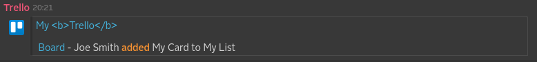

###### "updateCard"
* Event maps to:
1. "cardArchivedUnarchived" [JSON payload](src/test/resources/payload_trello_card_archived.json)

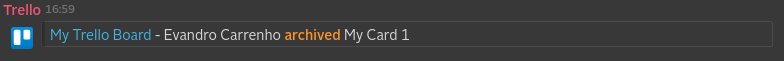
2. "cardMoved" [JSON payload](src/test/resources/payload_trello_card_moved.json)

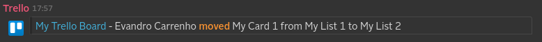
3. "cardRenamed" [JSON payload](src/test/resources/payload_trello_card_renamed.json)

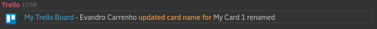
4. "cardDueDateChanged" [JSON payload](src/test/resources/payload_trello_card_due_date_changed.json)

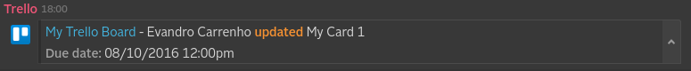
5. "cardDescriptionChanged" [JSON payload](src/test/resources/payload_trello_card_description_changed.json)

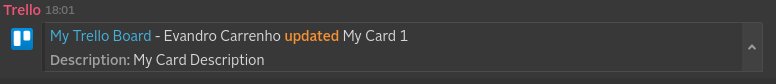

###### "commentCard"
* Event maps to "commentAddedToCard"
[JSON payload](src/test/resources/payload_trello_card_commented.json)

Converted to Symphony Message ML
```xml
<messageML>
    <entity type="com.symphony.integration.trello.event.commentCard" version="1.0">
        <presentationML>
            User Test on My Card<br/>
            "My comment on this card"
        </presentationML>
        <attribute name="date" type="org.symphonyoss.time.rfc3339" value="2016-08-04T14:28:37.415Z"/>
        <entity name="memberCreator" type="com.symphony.integration.trello.user" version="1.0">
            <attribute name="username" type="org.symphonyoss.string" value="usertest"/>
            <attribute name="displayName" type="org.symphonyoss.string" value="User Test"/>
        </entity>
        <entity type="com.symphony.integration.trello.data" version="1.0">
            <attribute name="comment" type="org.symphonyoss.string" value="My comment on this card"/>
            <entity type="com.symphony.integration.trello.board" version="1.0">
                <attribute name="shortUrl" type="com.symphony.uri" value="https://trello.com/t0hu7Ffx"/>
                <attribute name="name" type="org.symphonyoss.string" value="My Trello Board"/>
                <attribute name="id" type="org.symphonyoss.string" value="57a34b33b350eb2bcc1f42ca"/>
            </entity>
            <entity type="com.symphony.integration.trello.list" version="1.0">
                <attribute name="name" type="org.symphonyoss.string" value="My List 1"/>
                <attribute name="id" type="org.symphonyoss.string" value="57a34bdaa4050393a6f15a24"/>
            </entity>
            <entity type="com.symphony.integration.trello.card" version="1.0">
                <attribute name="shortLink" type="org.symphonyoss.string" value="QazveT2S"/>
                <attribute name="name" type="org.symphonyoss.string" value="My Card"/>
                <attribute name="id" type="org.symphonyoss.string" value="57a35009784b0df0be746cbc"/>
                <attribute name="idShort" type="org.symphony.oss.number.int" value="1"/>
            </entity>
        </entity>
    </entity>
</messageML>
```
Message rendered on Symphony

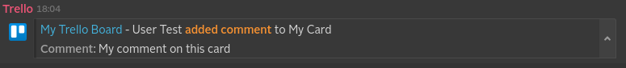

###### "addAttachmentToCard"
* Event maps to "attachmentAddedToCard"

[JSON payload](src/test/resources/payload_trello_attachment_dropbox.json)

Converted to Symphony Message ML
```xml
<messageML>
    <entity type="com.symphony.integration.trello.event.addAttachmentToCard" version="1.0">
        <presentationML>
            Evandro Carrenho add the attachment "How to use the Public folder.rtf" (<a href="https://www.dropbox.com/s/52ftsudpz665u5p/How%20to%20use%20the%20Public%20folder.rtf?dl=0"/>) to Renamed card in Another Trello Board (<a href="https://trello.com/b/N4sE9Ueu"/>)
        </presentationML>
        <attribute name="date" type="org.symphonyoss.time.rfc3339" value="2016-09-27T16:13:38.793Z"/>
        <entity name="memberCreator" type="com.symphony.integration.trello.user" version="1.0">
            <attribute name="username" type="org.symphonyoss.string" value="ecarrenhosymphonytest"/>
            <attribute name="emailAddress" type="org.symphonyoss.string" value="ecarrenhosymphonytest@symphony.com"/>
            <attribute name="displayName" type="org.symphonyoss.string" value="Evandro Carrenho"/>
            <entity type="com.symphony.mention" version="1.0">
                <attribute name="id" type="org.symphony.oss.number.long" value="699722783"/>
                <attribute name="name" type="org.symphonyoss.string" value="Evandro Carrenho"/>
            </entity>
        </entity>
        <entity type="com.symphony.integration.trello.data" version="1.0">
            <entity type="com.symphony.integration.trello.board" version="1.0">
                <attribute name="shortUrl" type="com.symphony.uri" value="https://trello.com/b/N4sE9Ueu"/>
                <attribute name="name" type="org.symphonyoss.string" value="Another Trello Board"/>
                <attribute name="id" type="org.symphonyoss.string" value="57a34f3e36e1e889b0dfca55"/>
            </entity>
            <entity type="com.symphony.integration.trello.card" version="1.0">
                <attribute name="shortLink" type="org.symphonyoss.string" value="dUz5fzV0"/>
                <attribute name="name" type="org.symphonyoss.string" value="Renamed card"/>
                <attribute name="id" type="org.symphonyoss.string" value="57ea99ab4e60503af5708af4"/>
                <attribute name="idShort" type="org.symphony.oss.number.int" value="1"/>
            </entity>
            <entity type="com.symphony.integration.trello.attachment" version="1.0">
                <attribute name="url" type="com.symphony.uri" value="https://www.dropbox.com/s/52ftsudpz665u5p/How%20to%20use%20the%20Public%20folder.rtf?dl=0"/>
                <attribute name="name" type="org.symphonyoss.string" value="How to use the Public folder.rtf"/>
                <attribute name="id" type="org.symphonyoss.string" value="57ea9b75d2198ee98e034d18"/>
            </entity>
        </entity>
    </entity>
</messageML>
```
Message rendered on Symphony

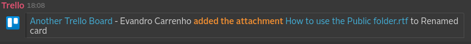

###### "addLabelToCard"
* Event maps to "cardLabelChanged"

[JSON payload](src/test/resources/payload_trello_label_added.json)

Converted to Symphony Message ML
```xml
<messageML>
    <entity type="com.symphony.integration.trello.event.addLabelToCard" version="1.0">
        <presentationML>
            Evandro Carrenho added the label "Black Label" to My Card 1 (in My Trello Board) (<a href="https://trello.com/b/t0hu7Ffx"/>)
        </presentationML>
        <attribute name="date" type="org.symphonyoss.time.rfc3339" value="2016-08-05T16:48:01.304Z"/>
        <entity name="memberCreator" type="com.symphony.integration.trello.user" version="1.0">
            <attribute name="username" type="org.symphonyoss.string" value="ecarrenhosymphony"/>
            <attribute name="displayName" type="org.symphonyoss.string" value="Evandro Carrenho"/>
        </entity>
        <entity type="com.symphony.integration.trello.data" version="1.0">
            <entity type="com.symphony.integration.trello.board" version="1.0">
                <attribute name="shortUrl" type="com.symphony.uri" value="https://trello.com/b/t0hu7Ffx"/>
                <attribute name="name" type="org.symphonyoss.string" value="My Trello Board"/>
                <attribute name="id" type="org.symphonyoss.string" value="57a34b33b350eb2bcc1f42ca"/>
            </entity>
            <entity type="com.symphony.integration.trello.card" version="1.0">
                <attribute name="shortLink" type="org.symphonyoss.string" value="thH8QUqG"/>
                <attribute name="name" type="org.symphonyoss.string" value="My Card 1"/>
                <attribute name="id" type="org.symphonyoss.string" value="57a4a5aad6759eba0f594ec2"/>
                <attribute name="idShort" type="org.symphony.oss.number.int" value="7"/>
            </entity>
            <entity type="com.symphony.integration.trello.label" version="1.0">
                <attribute name="color" type="org.symphonyoss.string" value="black"/>
                <attribute name="name" type="org.symphonyoss.string" value="Black Label"/>
                <attribute name="id" type="org.symphonyoss.string" value="57a34b3384e677fd36cc13b8"/>
            </entity>
        </entity>
    </entity>
</messageML>
```
Message rendered on Symphony

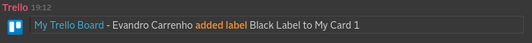

###### "removeLabelFromCard"
* Event maps to "cardLabelChanged"

[JSON payload](src/test/resources/payload_trello_label_removed.json)

Converted to Symphony Message ML
```xml
<messageML>
    <entity type="com.symphony.integration.trello.event.removeLabelFromCard" version="1.0">
        <presentationML>
            Evandro Carrenho removed the label "Black Label" from My Card 1 (in My Trello Board) (<a href="https://trello.com/b/t0hu7Ffx"/>)
        </presentationML>
        <attribute name="date" type="org.symphonyoss.time.rfc3339" value="2016-08-05T16:48:01.304Z"/>
        <entity name="memberCreator" type="com.symphony.integration.trello.user" version="1.0">
            <attribute name="username" type="org.symphonyoss.string" value="ecarrenhosymphony"/>
            <attribute name="displayName" type="org.symphonyoss.string" value="Evandro Carrenho"/>
        </entity>
        <entity type="com.symphony.integration.trello.data" version="1.0">
            <entity type="com.symphony.integration.trello.board" version="1.0">
                <attribute name="shortUrl" type="com.symphony.uri" value="https://trello.com/b/t0hu7Ffx"/>
                <attribute name="name" type="org.symphonyoss.string" value="My Trello Board"/>
                <attribute name="id" type="org.symphonyoss.string" value="57a34b33b350eb2bcc1f42ca"/>
            </entity>
            <entity type="com.symphony.integration.trello.card" version="1.0">
                <attribute name="shortLink" type="org.symphonyoss.string" value="thH8QUqG"/>
                <attribute name="name" type="org.symphonyoss.string" value="My Card 1"/>
                <attribute name="id" type="org.symphonyoss.string" value="57a4a5aad6759eba0f594ec2"/>
                <attribute name="idShort" type="org.symphony.oss.number.int" value="7"/>
            </entity>
            <entity type="com.symphony.integration.trello.label" version="1.0">
                <attribute name="color" type="org.symphonyoss.string" value="black"/>
                <attribute name="name" type="org.symphonyoss.string" value="Black Label"/>
                <attribute name="id" type="org.symphonyoss.string" value="57a34b3384e677fd36cc13b8"/>
            </entity>
        </entity>
    </entity>
</messageML>
```
Message rendered on Symphony

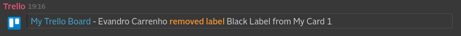

###### "addMemberToCard"
* Event maps to "memberAddedToCard"

[JSON payload](src/test/resources/payload_trello_card_member_added.json)

Converted to Symphony Message ML
```xml
<messageML>
    <entity type="com.symphony.integration.trello.event.addMemberToCard" version="1.0">
        <presentationML>
            Test User added Evandro Carrenho to My Card 1 (in My Trello Board) (<a href="https://trello.com/t0hu7Ffx"/>)
        </presentationML>
        <attribute name="date" type="org.symphonyoss.time.rfc3339" value="2016-08-05T16:52:10.237Z"/>
        <entity name="memberCreator" type="com.symphony.integration.trello.user" version="1.0">
            <attribute name="username" type="org.symphonyoss.string" value="testuser"/>
            <attribute name="emailAddress" type="org.symphonyoss.string" value="testuser@symphony.com"/>
            <attribute name="displayName" type="org.symphonyoss.string" value="Test User"/>
            <entity type="com.symphony.mention" version="1.0">
                <attribute name="id" type="org.symphony.oss.number.long" value="699722783"/>
                <attribute name="name" type="org.symphonyoss.string" value="Test User"/>
            </entity>
        </entity>
        <entity name="member" type="com.symphony.integration.trello.user" version="1.0">
            <attribute name="username" type="org.symphonyoss.string" value="evandrocarrenho"/>
            <attribute name="emailAddress" type="org.symphonyoss.string" value="evandrocarrenho@symphony.com"/>
            <attribute name="displayName" type="org.symphonyoss.string" value="Evandro Carrenho"/>
            <entity type="com.symphony.mention" version="1.0">
                <attribute name="id" type="org.symphony.oss.number.long" value="699722784"/>
                <attribute name="name" type="org.symphonyoss.string" value="Evandro Carrenho"/>
            </entity>
        </entity>
        <entity type="com.symphony.integration.trello.data" version="1.0">
            <attribute name="idMember" type="org.symphonyoss.string" value="547da2aa2c96e3655d7c1612"/>
            <entity type="com.symphony.integration.trello.board" version="1.0">
                <attribute name="shortUrl" type="com.symphony.uri" value="https://trello.com/t0hu7Ffx"/>
                <attribute name="name" type="org.symphonyoss.string" value="My Trello Board"/>
                <attribute name="id" type="org.symphonyoss.string" value="57a34b33b350eb2bcc1f42ca"/>
            </entity>
            <entity type="com.symphony.integration.trello.card" version="1.0">
                <attribute name="shortLink" type="org.symphonyoss.string" value="thH8QUqG"/>
                <attribute name="name" type="org.symphonyoss.string" value="My Card 1"/>
                <attribute name="id" type="org.symphonyoss.string" value="57a4a5aad6759eba0f594ec2"/>
                <attribute name="idShort" type="org.symphony.oss.number.int" value="7"/>
            </entity>
        </entity>
    </entity>
</messageML>
```
Message rendered on Symphony

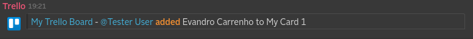

###### "convertToCardFromCheckItem"
* Event stays the same

[JSON payload](src/test/resources/payload_trello_card_from_checkitem.json)

Converted to Symphony Message ML
```xml
<messageML>
    <entity type="com.symphony.integration.trello.event.convertToCardFromCheckItem" version="1.0">
        <presentationML>
            Evandro Carrenho converted Comments entity builder from a checklist item on Need to add the ability to see comments (<a href="https://trello.com/b/t0hu7Ffx"/>)
        </presentationML>
        <attribute name="date" type="org.symphonyoss.time.rfc3339" value="2016-09-13T16:18:38.654Z"/>
        <entity name="memberCreator" type="com.symphony.integration.trello.user" version="1.0">
            <attribute name="username" type="org.symphonyoss.string" value="ecarrenhosymphonytest"/>
            <attribute name="displayName" type="org.symphonyoss.string" value="Evandro Carrenho"/>
        </entity>
        <entity type="com.symphony.integration.trello.data" version="1.0">
            <entity type="com.symphony.integration.trello.board" version="1.0">
                <attribute name="shortUrl" type="com.symphony.uri" value="https://trello.com/b/t0hu7Ffx"/>
                <attribute name="name" type="org.symphonyoss.string" value="Symphony Innovate"/>
                <attribute name="id" type="org.symphonyoss.string" value="57a34b33b350eb2bcc1f42ca"/>
                <entity type="com.symphony.integration.trello.prefs" version="1.0">
                    <attribute name="background" type="org.symphonyoss.string" value="blue"/>
                    <attribute name="backgroundColor" type="org.symphonyoss.string" value="#0079BF"/>
                </entity>
            </entity>
            <entity type="com.symphony.integration.trello.list" version="1.0">
                <attribute name="name" type="org.symphonyoss.string" value="Do Trello Parsers"/>
                <attribute name="id" type="org.symphonyoss.string" value="57d6ec9303e4f6b21c1696a9"/>
            </entity>
            <entity name="card" type="com.symphony.integration.trello.card" version="1.0">
                <attribute name="name" type="org.symphonyoss.string" value="Comments entity builder"/>
                <attribute name="id" type="org.symphonyoss.string" value="57d826de3fbb7c89a046dfac"/>
                <attribute name="idShort" type="org.symphony.oss.number.int" value="13"/>
            </entity>
            <entity name="cardSource" type="com.symphony.integration.trello.card" version="1.0">
                <attribute name="shortLink" type="org.symphonyoss.string" value="woQM9Qqo"/>
                <attribute name="name" type="org.symphonyoss.string" value="Need to add the ability to see comments"/>
                <attribute name="id" type="org.symphonyoss.string" value="57d6ecdfcdddf493280e0d1b"/>
                <attribute name="idShort" type="org.symphony.oss.number.int" value="11"/>
            </entity>
        </entity>
    </entity>
</messageML>
```
Message rendered on Symphony

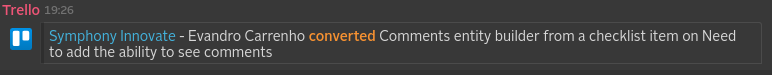


### Checklists
###### "addChecklistToCard"
* Event maps to "checklistCreated"

[JSON payload](src/test/resources/payload_trello_checklist_created.json)

Converted to Symphony Message ML
```xml
<messageML>
    <entity type="com.symphony.integration.trello.event.addChecklistToCard" version="1.0">
        <presentationML>
            Evandro Carrenho added Subtasks for comments viewing to Need to add the ability to see comments (<a href="https://trello.com/b/t0hu7Ffx"/>)
        </presentationML>
        <attribute name="date" type="org.symphonyoss.time.rfc3339" value="2016-09-13T12:50:32.129Z"/>
        <entity name="memberCreator" type="com.symphony.integration.trello.user" version="1.0">
            <attribute name="username" type="org.symphonyoss.string" value="ecarrenhosymphonytest"/>
            <attribute name="displayName" type="org.symphonyoss.string" value="Evandro Carrenho"/>
        </entity>
        <entity type="com.symphony.integration.trello.data" version="1.0">
            <entity type="com.symphony.integration.trello.board" version="1.0">
                <attribute name="shortUrl" type="com.symphony.uri" value="https://trello.com/b/t0hu7Ffx"/>
                <attribute name="name" type="org.symphonyoss.string" value="Symphony Innovate"/>
                <attribute name="id" type="org.symphonyoss.string" value="57a34b33b350eb2bcc1f42ca"/>
                <entity type="com.symphony.integration.trello.prefs" version="1.0">
                    <attribute name="background" type="org.symphonyoss.string" value="blue"/>
                    <attribute name="backgroundColor" type="org.symphonyoss.string" value="#0079BF"/>
                </entity>
            </entity>
            <entity type="com.symphony.integration.trello.card" version="1.0">
                <attribute name="shortLink" type="org.symphonyoss.string" value="woQM9Qqo"/>
                <attribute name="name" type="org.symphonyoss.string" value="Need to add the ability to see comments"/>
                <attribute name="id" type="org.symphonyoss.string" value="57d6ecdfcdddf493280e0d1b"/>
                <attribute name="idShort" type="org.symphony.oss.number.int" value="11"/>
            </entity>
            <entity type="com.symphony.integration.trello.checklist" version="1.0">
                <attribute name="name" type="org.symphonyoss.string" value="Subtasks for comments viewing"/>
                <attribute name="id" type="org.symphonyoss.string" value="57d7f618834f6a46c2badc0a"/>
            </entity>
        </entity>
    </entity>
</messageML>
```
Message rendered on Symphony

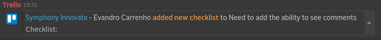

###### "createCheckItem"
* Event maps to "checklistItemCreated"

[JSON payload](src/test/resources/payload_trello_checkitem_create.json)

Converted to Symphony Message ML
```xml
<messageML>
    <entity type="com.symphony.integration.trello.event.createCheckItem" version="1.0">
        <presentationML>
            Evandro Carrenho added Comments renderer to Subtasks for comments viewing in Need to add the ability to see comments (<a href="https://trello.com/b/t0hu7Ffx"/>)
        </presentationML>
        <attribute name="date" type="org.symphonyoss.time.rfc3339" value="2016-09-13T13:34:53.901Z"/>
        <entity name="memberCreator" type="com.symphony.integration.trello.user" version="1.0">
            <attribute name="username" type="org.symphonyoss.string" value="ecarrenhosymphonytest"/>
            <attribute name="displayName" type="org.symphonyoss.string" value="Evandro Carrenho"/>
        </entity>
        <entity type="com.symphony.integration.trello.data" version="1.0">
            <entity type="com.symphony.integration.trello.board" version="1.0">
                <attribute name="shortUrl" type="com.symphony.uri" value="https://trello.com/b/t0hu7Ffx"/>
                <attribute name="name" type="org.symphonyoss.string" value="Symphony Innovate"/>
                <attribute name="id" type="org.symphonyoss.string" value="57a34b33b350eb2bcc1f42ca"/>
                <entity type="com.symphony.integration.trello.prefs" version="1.0">
                    <attribute name="background" type="org.symphonyoss.string" value="blue"/>
                    <attribute name="backgroundColor" type="org.symphonyoss.string" value="#0079BF"/>
                </entity>
            </entity>
            <entity type="com.symphony.integration.trello.card" version="1.0">
                <attribute name="shortLink" type="org.symphonyoss.string" value="woQM9Qqo"/>
                <attribute name="name" type="org.symphonyoss.string" value="Need to add the ability to see comments"/>
                <attribute name="id" type="org.symphonyoss.string" value="57d6ecdfcdddf493280e0d1b"/>
                <attribute name="idShort" type="org.symphony.oss.number.int" value="11"/>
            </entity>
            <entity type="com.symphony.integration.trello.checklist" version="1.0">
                <attribute name="name" type="org.symphonyoss.string" value="Subtasks for comments viewing"/>
                <attribute name="id" type="org.symphonyoss.string" value="57d7f618834f6a46c2badc0a"/>
            </entity>
            <entity type="com.symphony.integration.trello.checkItem" version="1.0">
                <attribute name="state" type="org.symphonyoss.string" value="incomplete"/>
                <attribute name="name" type="org.symphonyoss.string" value="Comments renderer"/>
                <attribute name="id" type="org.symphonyoss.string" value="57d8007dd4b23351441c4cde"/>
            </entity>
        </entity>
    </entity>
</messageML>
```
Message rendered on Symphony

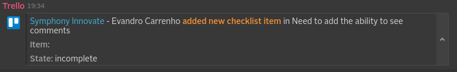

###### "updateCheckItem"
* Event maps to "checklistItemUpdated"

[JSON payload](src/test/resources/payload_trello_checkitem_update.json)

Converted to Symphony Message ML
```xml
<messageML>
    <entity type="com.symphony.integration.trello.event.updateCheckItem" version="1.0">
        <presentationML>
            Evandro Carrenho updated Comments entity builder on Need to add the ability to see comments (<a href="https://trello.com/b/t0hu7Ffx"/>)
        </presentationML>
        <attribute name="date" type="org.symphonyoss.time.rfc3339" value="2016-09-13T16:17:12.517Z"/>
        <entity name="memberCreator" type="com.symphony.integration.trello.user" version="1.0">
            <attribute name="username" type="org.symphonyoss.string" value="ecarrenhosymphonytest"/>
            <attribute name="displayName" type="org.symphonyoss.string" value="Evandro Carrenho"/>
        </entity>
        <entity type="com.symphony.integration.trello.data" version="1.0">
            <entity type="com.symphony.integration.trello.board" version="1.0">
                <attribute name="shortUrl" type="com.symphony.uri" value="https://trello.com/b/t0hu7Ffx"/>
                <attribute name="name" type="org.symphonyoss.string" value="Symphony Innovate"/>
                <attribute name="id" type="org.symphonyoss.string" value="57a34b33b350eb2bcc1f42ca"/>
                <entity type="com.symphony.integration.trello.prefs" version="1.0">
                    <attribute name="background" type="org.symphonyoss.string" value="blue"/>
                    <attribute name="backgroundColor" type="org.symphonyoss.string" value="#0079BF"/>
                </entity>
            </entity>
            <entity type="com.symphony.integration.trello.card" version="1.0">
                <attribute name="shortLink" type="org.symphonyoss.string" value="woQM9Qqo"/>
                <attribute name="name" type="org.symphonyoss.string" value="Need to add the ability to see comments"/>
                <attribute name="id" type="org.symphonyoss.string" value="57d6ecdfcdddf493280e0d1b"/>
                <attribute name="idShort" type="org.symphony.oss.number.int" value="11"/>
            </entity>
            <entity type="com.symphony.integration.trello.checklist" version="1.0">
                <attribute name="name" type="org.symphonyoss.string" value="Subtasks for comments viewing"/>
                <attribute name="id" type="org.symphonyoss.string" value="57d7f618834f6a46c2badc0a"/>
            </entity>
            <entity type="com.symphony.integration.trello.checkItem" version="1.0">
                <attribute name="state" type="org.symphonyoss.string" value="incomplete"/>
                <attribute name="name" type="org.symphonyoss.string" value="Comments entity builder"/>
                <attribute name="id" type="org.symphonyoss.string" value="57d814cd8e8910365e9ff2cc"/>
            </entity>
            <entity type="com.symphony.integration.trello.changelog" version="1.0">
                <entity type="com.symphony.integration.trello.change" version="1.0">
                    <attribute name="fieldName" type="org.symphonyoss.string" value="name"/>
                    <attribute name="oldValue" type="org.symphonyoss.string" value="Comments entity"/>
                    <attribute name="newValue" type="org.symphonyoss.string" value="Comments entity builder"/>
                </entity>
            </entity>
        </entity>
    </entity>
</messageML>
```
Message rendered on Symphony


###### "updateCheckItemStateOnCard"
* Event maps to "checklistItemUpdated"

[JSON payload for variation: Complete](src/test/resources/payload_trello_checkitem_state_complete.json)
[JSON payload for variation: Incomplete](src/test/resources/payload_trello_checkitem_state_incomplete.json)

Converted to Symphony Message ML (complete only)
```xml
<messageML>
    <entity type="com.symphony.integration.trello.event.updateCheckItemStateOnCard" version="1.0">
        <presentationML>
            Evandro Carrenho completed Comments renderer on Need to add the ability to see comments (<a href="https://trello.com/b/t0hu7Ffx"/>)
        </presentationML>
        <attribute name="date" type="org.symphonyoss.time.rfc3339" value="2016-09-13T15:54:46.466Z"/>
        <entity name="memberCreator" type="com.symphony.integration.trello.user" version="1.0">
            <attribute name="username" type="org.symphonyoss.string" value="ecarrenhosymphonytest"/>
            <attribute name="displayName" type="org.symphonyoss.string" value="Evandro Carrenho"/>
        </entity>
        <entity type="com.symphony.integration.trello.data" version="1.0">
            <entity type="com.symphony.integration.trello.board" version="1.0">
                <attribute name="shortUrl" type="com.symphony.uri" value="https://trello.com/b/t0hu7Ffx"/>
                <attribute name="name" type="org.symphonyoss.string" value="Symphony Innovate"/>
                <attribute name="id" type="org.symphonyoss.string" value="57a34b33b350eb2bcc1f42ca"/>
                <entity type="com.symphony.integration.trello.prefs" version="1.0">
                    <attribute name="background" type="org.symphonyoss.string" value="blue"/>
                    <attribute name="backgroundColor" type="org.symphonyoss.string" value="#0079BF"/>
                </entity>
            </entity>
            <entity type="com.symphony.integration.trello.card" version="1.0">
                <attribute name="shortLink" type="org.symphonyoss.string" value="woQM9Qqo"/>
                <attribute name="name" type="org.symphonyoss.string" value="Need to add the ability to see comments"/>
                <attribute name="id" type="org.symphonyoss.string" value="57d6ecdfcdddf493280e0d1b"/>
                <attribute name="idShort" type="org.symphony.oss.number.int" value="11"/>
            </entity>
            <entity type="com.symphony.integration.trello.checklist" version="1.0">
                <attribute name="name" type="org.symphonyoss.string" value="Subtasks for comments viewing"/>
                <attribute name="id" type="org.symphonyoss.string" value="57d7f618834f6a46c2badc0a"/>
            </entity>
            <entity type="com.symphony.integration.trello.checkItem" version="1.0">
                <attribute name="state" type="org.symphonyoss.string" value="complete"/>
                <attribute name="name" type="org.symphonyoss.string" value="Comments renderer"/>
                <attribute name="id" type="org.symphonyoss.string" value="57d8007dd4b23351441c4cde"/>
            </entity>
        </entity>
    </entity>
</messageML>
```
Message rendered on Symphony

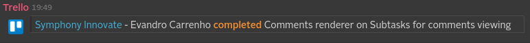

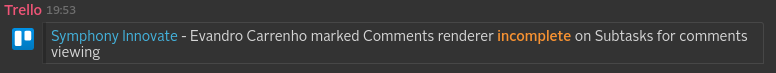


### Lists
###### "createList"
* Event maps to "listCreated"

[JSON payload](src/test/resources/payload_trello_list_created.json)

Converted to Symphony Message ML
```xml
<messageML>
    <entity type="com.symphony.integration.trello.event.createList" version="1.0">
        <presentationML>
            Test User created My List 1 in My Trello Board (<a href="https://trello.com/b/t0hu7Ffx"/>)
        </presentationML>
        <attribute name="date" type="org.symphonyoss.time.rfc3339" value="2016-08-04T14:06:18.173Z"/>
        <entity name="memberCreator" type="com.symphony.integration.trello.user" version="1.0">
            <attribute name="username" type="org.symphonyoss.string" value="testusersymphony"/>
            <attribute name="displayName" type="org.symphonyoss.string" value="Test User"/>
        </entity>
        <entity type="com.symphony.integration.trello.data" version="1.0">
            <entity type="com.symphony.integration.trello.board" version="1.0">
                <attribute name="shortUrl" type="com.symphony.uri" value="https://trello.com/b/t0hu7Ffx"/>
                <attribute name="name" type="org.symphonyoss.string" value="My Trello Board"/>
                <attribute name="id" type="org.symphonyoss.string" value="57a34b33b350eb2bcc1f42ca"/>
            </entity>
            <entity type="com.symphony.integration.trello.list" version="1.0">
                <attribute name="name" type="org.symphonyoss.string" value="My List 1"/>
                <attribute name="id" type="org.symphonyoss.string" value="57a34bdaa4050393a6f15a24"/>
            </entity>
        </entity>
    </entity>
</messageML>
```
Message rendered on Symphony

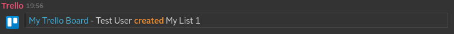

###### "updateList"
* Event maps to:
1. "listArchivedUnarchived" [JSON payload](src/test/resources/payload_trello_list_archived.json)

Converted to Symphony Message ML
```xml
<messageML>
    <entity type="com.symphony.integration.trello.event.updateList" version="1.0">
        <presentationML>
            Test User archived My List 1 from My Trello Board (<a href="https://trello.com/b/t0hu7Ffx"/>)
        </presentationML>
        <attribute name="date" type="org.symphonyoss.time.rfc3339" value="2016-08-05T14:19:03.352Z"/>
        <entity name="memberCreator" type="com.symphony.integration.trello.user" version="1.0">
            <attribute name="username" type="org.symphonyoss.string" value="testusersymphony"/>
            <attribute name="displayName" type="org.symphonyoss.string" value="Test User"/>
        </entity>
        <entity type="com.symphony.integration.trello.data" version="1.0">
            <entity type="com.symphony.integration.trello.board" version="1.0">
                <attribute name="shortUrl" type="com.symphony.uri" value="https://trello.com/b/t0hu7Ffx"/>
                <attribute name="name" type="org.symphonyoss.string" value="My Trello Board"/>
                <attribute name="id" type="org.symphonyoss.string" value="57a34b33b350eb2bcc1f42ca"/>
            </entity>
            <entity type="com.symphony.integration.trello.list" version="1.0">
                <attribute name="name" type="org.symphonyoss.string" value="My List 1"/>
                <attribute name="id" type="org.symphonyoss.string" value="57a34bdaa4050393a6f15a24"/>
                <attribute name="closed" type="org.symphonyoss.string" value="true"/>
            </entity>
            <entity type="com.symphony.integration.trello.changelog" version="1.0">
                <entity type="com.symphony.integration.trello.change" version="1.0">
                    <attribute name="fieldName" type="org.symphonyoss.string" value="closed"/>
                    <attribute name="oldValue" type="org.symphonyoss.string" value="false"/>
                    <attribute name="newValue" type="org.symphonyoss.string" value="true"/>
                </entity>
            </entity>
        </entity>
    </entity>
</messageML>
```
Message rendered on Symphony

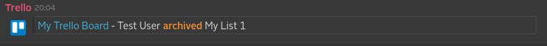
 
2. "listRenamed" [JSON payload](src/test/resources/payload_trello_list_renamed.json)

Converted to Symphony Message ML
```xml
<messageML>
    <entity type="com.symphony.integration.trello.event.updateList" version="1.0">
        <presentationML>
            Test User updated list name for My List 1 renamed in My Trello Board (<a href="https://trello.com/b/t0hu7Ffx"/>)
        </presentationML>
        <attribute name="date" type="org.symphonyoss.time.rfc3339" value="2016-08-04T14:14:45.145Z"/>
        <entity name="memberCreator" type="com.symphony.integration.trello.user" version="1.0">
            <attribute name="username" type="org.symphonyoss.string" value="testusersymphony"/>
            <attribute name="displayName" type="org.symphonyoss.string" value="Test User"/>
        </entity>
        <entity type="com.symphony.integration.trello.data" version="1.0">
            <entity type="com.symphony.integration.trello.board" version="1.0">
                <attribute name="shortUrl" type="com.symphony.uri" value="https://trello.com/b/t0hu7Ffx"/>
                <attribute name="name" type="org.symphonyoss.string" value="My Trello Board"/>
                <attribute name="id" type="org.symphonyoss.string" value="57a34b33b350eb2bcc1f42ca"/>
            </entity>
            <entity type="com.symphony.integration.trello.list" version="1.0">
                <attribute name="name" type="org.symphonyoss.string" value="My List 1 renamed"/>
                <attribute name="id" type="org.symphonyoss.string" value="57a34bdaa4050393a6f15a24"/>
            </entity>
            <entity type="com.symphony.integration.trello.changelog" version="1.0">
                <entity type="com.symphony.integration.trello.change" version="1.0">
                    <attribute name="fieldName" type="org.symphonyoss.string" value="name"/>
                    <attribute name="oldValue" type="org.symphonyoss.string" value="My List 1"/>
                    <attribute name="newValue" type="org.symphonyoss.string" value="My List 1 renamed"/>
                </entity>
            </entity>
        </entity>
    </entity>
</messageML>
```
Message rendered on Symphony

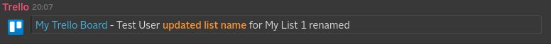

###### "moveListFromBoard"
* Event maps to "listMovedToOtherBoard"

[JSON payload](src/test/resources/payload_trello_list_moved.json)

Converted to Symphony Message ML
```xml
<messageML>
    <entity type="com.symphony.integration.trello.event.moveListFromBoard" version="1.0">
        <presentationML>
            Test User moved My List 2 from My Trello Board (<a href="https://trello.com/b/t0hu7Ffx"/>)
        </presentationML>
        <attribute name="date" type="org.symphonyoss.time.rfc3339" value="2016-08-04T14:21:36.556Z"/>
        <entity name="memberCreator" type="com.symphony.integration.trello.user" version="1.0">
            <attribute name="username" type="org.symphonyoss.string" value="testusersymphony"/>
            <attribute name="displayName" type="org.symphonyoss.string" value="Test User"/>
        </entity>
        <entity type="com.symphony.integration.trello.data" version="1.0">
            <entity type="com.symphony.integration.trello.board" version="1.0">
                <attribute name="shortUrl" type="com.symphony.uri" value="https://trello.com/b/t0hu7Ffx"/>
                <attribute name="name" type="org.symphonyoss.string" value="My Trello Board"/>
                <attribute name="id" type="org.symphonyoss.string" value="57a34b33b350eb2bcc1f42ca"/>
            </entity>
            <entity type="com.symphony.integration.trello.list" version="1.0">
                <attribute name="name" type="org.symphonyoss.string" value="My List 2"/>
                <attribute name="id" type="org.symphonyoss.string" value="57a34f1affafd51fd10e2071"/>
            </entity>
        </entity>
    </entity>
</messageML>
```
Message rendered on Symphony

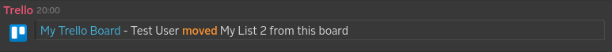


# Build instructions for the Java developer

### What you’ll build
You’ll build an integration module to be used with the [Integration Bridge](https://github.com/symphonyoss/App-Integrations-Core).

If you develop a new integration, to get it up and running you'll also need to add it to the core project's web pom file.

### What you’ll need
* JDK 1.7
* Maven 3.0.5+

### Build with maven
Trello WebHook Integration is compatible with Apache Maven 3.0.5 or above. If you don’t already have Maven installed you can follow the instructions at maven.apache.org.

To start from scratch, do the following:

1. Clone the source repository using Git: `git clone git@github.com:symphonyoss/App-Integrations-Trello.git`
2. cd into _App-Integrations-Trello_
3. Build using maven: `mvn clean install`

Notes: If you don't have access to Symphony Artifactory you should build the Commons module first to have it in your local maven repository. You can find the App-Integrations-Commons project [here](https://github.com/symphonyoss/App-Integrations-Commons)
